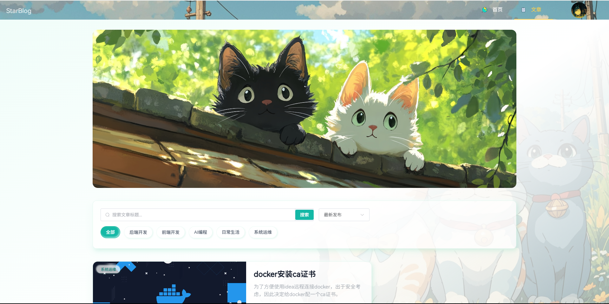
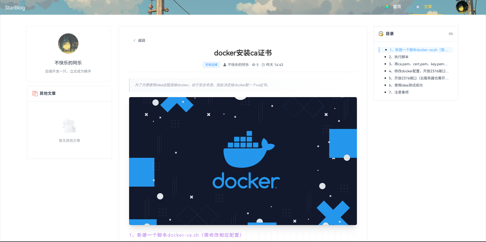
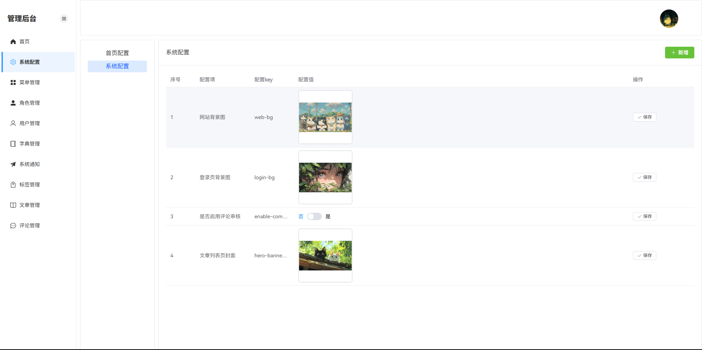

<div align="center">

# ⭐ StarBlogWeb

一个现代化的个人博客系统-前端工程，基于 Vue 3 + TypeScript + Vite 构建


</div>

---

## ✨ 核心特性

- 🚀 **现代化技术栈** - 基于 Vue 3 Composition API、TypeScript 5.5、Vite 7.1 构建，享受最新技术带来的开发体验
- 🔐 **动态权限路由** - 后端驱动的菜单系统，灵活的角色权限控制
- ✍️ **富文本编辑器** - 集成 ByteMD Markdown 编辑器和 Monaco 代码编辑器，支持 10+ 插件扩展
- ⚙️ **灵活的配置系统** - 支持多种配置类型（文本、数字、日期、图片、JSON等），可视化配置管理
- 📦 **生产级构建** - 自动代码压缩、资源优化、支持 CDN 部署
- 🎨 **精美的UI设计** - Element Plus + Tailwind CSS，响应式布局，流畅的交互体验

---


## 📸 界面展示

项目刚上线，内容待完善，有好的主意欢迎联系作者（如果有需要可以建群）。

ps：首页部分设计有参考[LittleDonkey](https://gitee.com/littledokey)大佬

### 首页


### 文章列表页


### 文章详情


### 后台管理


## 🔗 在线演示

- 在线地址：https://ale-star-blog.cn/home

个人开发者，请大佬手下留情，不要恶意攻击。

---

## 🛠️ 技术栈

### 核心框架

| 类别 | 技术 | 版本 
|------|------|------
| 前端框架 | Vue 3 | 3.5.25
| 开发语言 | TypeScript | 5.5.3
| 构建工具 | Vite | 7.1.12
| 包管理器 | pnpm | -

### UI & 样式

| 类别 | 技术 | 版本
|------|------|------
| 组件库 | Element Plus | 2.11.6
| CSS框架 | Tailwind CSS | 4.1.13
| 图标方案 | Iconify | 5.0.0
| 动画库 | Animate.css | 4.1.1
| 动画引擎 | Anime.js | 4.2.2

### 编辑器生态

| 类别 | 技术 | 版本
|------|------|------
| Markdown编辑器 | ByteMD | 1.22.0
| 代码编辑器 | Monaco Editor | 0.54.0
| 代码高亮 | Highlight.js | 11.11.1
| Markdown主题 | Juejin Themes | 1.34.0

### 状态与路由

| 类别 | 技术 | 版本
|------|------|------
| 路由管理 | Vue Router | 4.5.1
| 状态管理 | Pinia | 2.2.2
| 组合式工具 | VueUse | 14.1.0

### 工程化工具

| 类别 | 技术 | 版本
|------|------|------
| 代码规范 | ESLint + TypeScript ESLint | 9.9.1
| 自动导入 | unplugin-auto-import | 0.18.2
| 组件自动导入 | unplugin-vue-components | 0.27.4
| 代码压缩 | vite-plugin-compression | 0.5.1

---

## 📋 功能清单

### 博客前台

- 📄 **文章展示** - 文章列表与详情浏览，支持Markdown渲染
- 🏷️ **分类标签** - 多维度内容分类与标签筛选
- 💬 **评论互动** - 文章评论功能
- 🔍 **内容搜索** - 文章搜索与筛选

### 管理后台

#### 博客管理
- ✍️ **文章管理** - 文章创建、编辑、发布、删除，支持富文本编辑
- 🏷️ **标签管理** - 标签的增删改查
- 💬 **评论管理** - 评论审核与管理

#### 系统管理
- 📋 **菜单管理** - 动态路由配置，支持多级菜单
- 👥 **角色管理** - 角色创建与权限分配
- 📚 **字典管理** - 系统字典数据维护
- ⚙️ **系统配置** - 多类型配置项管理（文本、数字、日期、图片、JSON等）
- 📢 **通知管理** - 系统通知发布与管理

---

## 📁 项目结构

```
star-blog-web/
├── src/
│   ├── api/                 # API接口定义
│   ├── assets/              # 静态资源
│   ├── components/          # 公共组件
│   ├── config/              # 配置文件
│   ├── enums/               # 枚举定义
│   ├── layout/              # 布局组件
│   ├── plugins/             # 插件配置
│   ├── router/              # 路由配置
│   │   ├── guards/          # 路由守卫
│   │   ├── admin-router.ts  # 后台路由
│   │   └── common-router.ts # 公共路由
│   ├── stores/              # Pinia状态管理
│   ├── styles/              # 全局样式
│   ├── types/               # TypeScript类型定义
│   ├── uses/                # 组合式函数
│   ├── utils/               # 工具函数
│   ├── views/               # 页面视图
│   │   ├── admin/           # 管理后台
│   │   │   ├── blog/        # 博客管理（文章、标签、评论）
│   │   │   └── system/      # 系统管理（菜单、角色、字典、配置）
│   │   ├── blog/            # 博客前台
│   │   ├── home/            # 首页
│   │   └── login/           # 登录页
│   ├── App.vue              # 根组件
│   └── main.ts              # 应用入口
├── public/                  # 公共静态资源
├── build/                   # 构建脚本
├── vite.config.ts           # Vite配置
├── tsconfig.json            # TypeScript配置
├── eslint.config.mjs        # ESLint配置
├── tailwind.config.js       # Tailwind配置
└── package.json             # 项目依赖
```

---

## 🚀 快速开始

### 环境要求

- Node.js >= 18.0.0
- pnpm >= 8.0.0

### 安装步骤

```bash
# 1. 克隆项目
git clone <repository-url>
cd star-blog-web

# 2. 安装依赖
pnpm install

# 3. 配置环境变量
# 复制.env.example为.env并配置相关参数
cp .env.example .env

# 4. 启动开发服务器
pnpm dev

# 5. 构建生产版本
pnpm build

# 6. 预览生产构建
pnpm preview
```

### 环境变量配置

在项目根目录创建 `.env` 文件，配置以下参数：

```env
VITE_API_BASE_URL=http://localhost:3000/api    # API基础路径
VITE_APP_TITLE=StarBlog                         # 应用标题
VITE_OSS_URL=https://your-oss-domain.com       # OSS服务地址
```

---

## 🤝 贡献指南

欢迎提交 Issue 或 Pull Request 来帮助改进项目。

### 提交 Issue

- 提供详细的问题描述
- 包含复现步骤和环境信息
- 附上相关截图或日志

### 提交 Pull Request

- Fork 本仓库并创建新分支
- 遵循项目代码规范
- 提交前执行 `pnpm lint` 检查代码
- 提供清晰的 PR 描述

---

## ⭐ Star

本人也是深受开源项目启发，因此本项目也是选择开源，希望能给更多朋友带来一点点启发。
如果这个项目对你有帮助，欢迎 Star 支持！

---

## 📜 开源协议

本项目基于 [Apache License 2.0](LICENSE) 开源协议。

---
